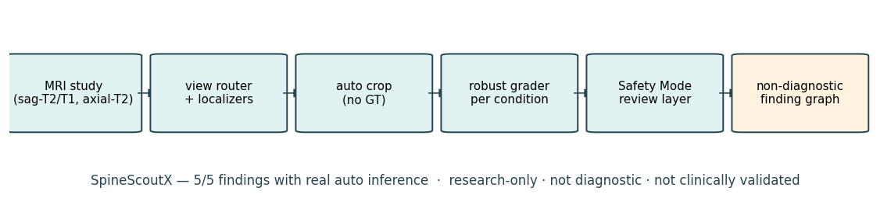
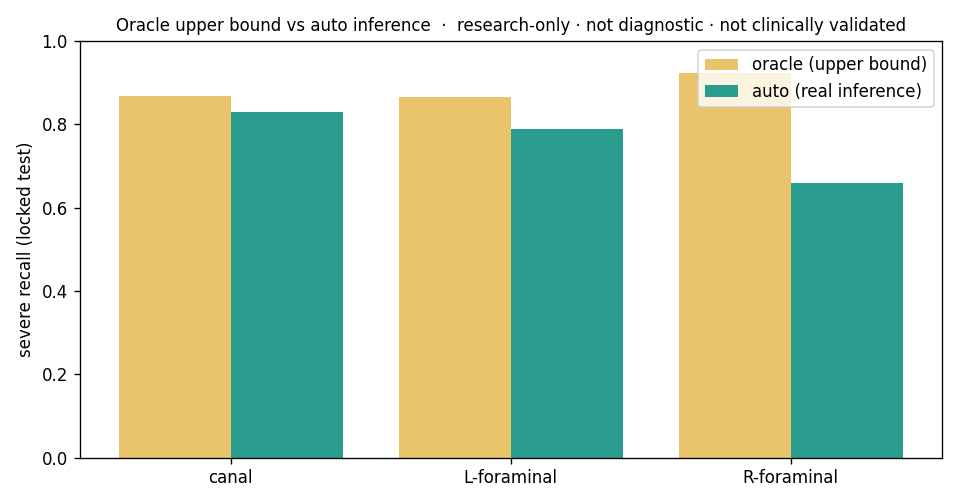

# SpineScoutX

**A research-only, anatomy-grounded lumbar-MRI pipeline that trains and evaluates on the
*auto-localized inference distribution* and produces non-diagnostic, severe-safety-aware
study-level finding graphs — with confidence intervals on a locked test.**

> ⚠️ **Research-only · not diagnostic · not clinically validated · not for medical
> decision-making · no treatment recommendations.** Outputs are *research severity
> estimates / finding graphs*, never a diagnosis. Uses public non-commercial research
> datasets (RSNA LumbarDISC; SPIDER, CC BY 4.0); no data is redistributed.



**Auto coverage: 5/5 RSNA findings** have real auto-localized locked-test results (canal ·
left/right neural foraminal narrowing · left/right subarticular stenosis).


---

## What it does (30-second version)
A lumbar MRI study → a **view router + per-condition localizers** (sagittal-T2 for canal,
sagittal-T1 side-aware for foraminal, axial-T2 level-scored for subarticular) → **crops
placed with no ground-truth coordinates** → **robust per-condition graders** → a
**severe-first Safety Mode** (operating points + review flags) → a **deterministic,
non-diagnostic finding graph**. Every headline number is on a **patient-level locked test**
with cluster-bootstrap 95% CIs, and every metric is tagged *oracle* (GT-coordinate upper
bound) vs *auto* (real inference).

## Headline results — locked test, **auto** (real inference)
Severe recall (the safety-critical axis), with 95% CIs (cluster-bootstrap by study):

| finding | view route | auto severe recall [95% CI] | n_severe | deployable grader |
|---|---|---|---|---|
| spinal canal stenosis | sagittal-T2 | **0.830 [0.725, 0.929]** | 53 | auto-trained robust |
| left neural foraminal narrowing | sagittal-T1 | **0.788 [0.673, 0.892]** | 52 | oracle-trained |
| right neural foraminal narrowing | sagittal-T1 | **0.660 [0.524, 0.788]** | 53 | oracle-trained |
| left subarticular stenosis | axial-T2 | **0.746 [0.674, 0.815]** | 138 | auto-trained robust |
| right subarticular stenosis | axial-T2 | **0.737 [0.667, 0.807]** | 137 | auto-trained robust |

**The core scientific result:** the value of *robust auto-training* (training the grader
on the auto-localized distribution) is governed by the **oracle→auto gap**. Where
localization is hard (canal's heavy-tailed localizer; axial subarticular's imperfect level
matching) the oracle-trained grader **collapses** and auto-training **recovers** it
(canal 0.43→0.83; subarticular 0.25/0.37→0.75/0.74, both decisive, McNemar p<1e-12). Where
localization is clean (foraminal, crop-hit 0.999) the gap is small and the oracle-trained
grader transfers directly. **Pick the grader per condition.**



## Severe-first Safety Mode
Per condition: a severe-recall / false-alarm frontier plus a `review_required` layer
(low confidence, high entropy, model disagreement). Reaching 90% severe recall has an
explicit false-alarm or review-burden cost, reported plainly — never hidden.


## Example output — non-diagnostic finding graph
Per-level severity estimate · P(severe) · calibrated confidence · uncertainty flag · review
reason · provenance (auto vs oracle-only). Examples: `outputs/real/reports_v3/` (gitignored,
regenerable via `python scripts/run_report_v3.py`); schema in
[`docs/run_logs/report_v3.md`](docs/run_logs/report_v3.md).

## Limitations (read this)
- **Not diagnostic, not clinically validated, no external/prospective validation.**
- Severe counts are modest per condition (≈52–138) → CIs are wide; we use paired tests.
- Right-foraminal (0.660) trails left (0.788), within CI overlap (likely sample size).
- Subarticular auto relies on the grader **tolerating** an imperfect axial level scorer
  (±1 slice-hit 0.43); a better scorer is future work. Reported transparently.
- SPIDER anatomy masks are anatomy, not pathology; foraminal/subarticular evidence regions
  are approximate. See [`docs/safety.md`](docs/safety.md).

## Quickstart
```bash
pip install -e .
spinescoutx doctor --data                 # checks RSNA/SPIDER availability + deps
# locked-test protocol + per-condition auto routes (data required; see docs/data_setup.md):
python scripts/build_splits_v1.py
python scripts/run_canal_locked_test.py
python scripts/run_foraminal_locked_test.py
python scripts/run_axial_level_scorer.py && python scripts/run_subarticular_locked_test.py
python scripts/run_safety_mode_v4.py      # 5/5 severe-first dashboard
python scripts/run_report_v3.py           # example non-diagnostic finding graphs
```

## More
- 🖼 **Gallery:** [`docs/gallery.md`](docs/gallery.md)
- 📊 **Full results (CIs, oracle vs auto, per condition):** [`docs/results.md`](docs/results.md)
- 🧪 **Technical report:** [`docs/technical_report.md`](docs/technical_report.md)
- 🪪 **Model card:** [`docs/model_card.md`](docs/model_card.md) · **Dataset card:** [`docs/dataset_card.md`](docs/dataset_card.md)
- 🔒 **Safety & claims policy:** [`docs/safety.md`](docs/safety.md)
- 🔁 **Reproducibility:** [`docs/reproducibility.md`](docs/reproducibility.md)

## License
Source code: MIT (see [`LICENSE`](LICENSE)). **Datasets are NOT covered by MIT** and are not
included (RSNA non-commercial; SPIDER CC BY 4.0) — obtain them yourself under their terms.
No DICOMs, masks, checkpoints, caches, or runs are committed.
