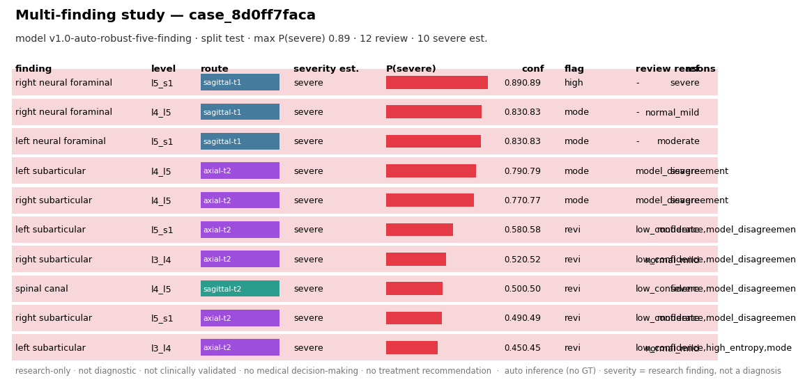
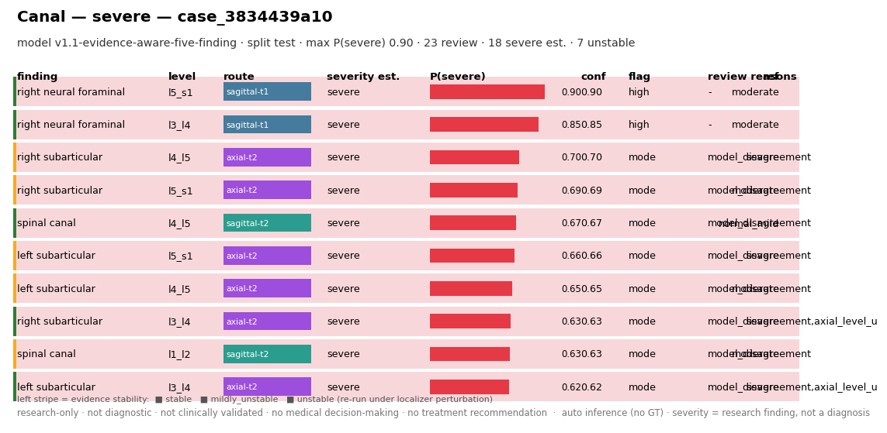
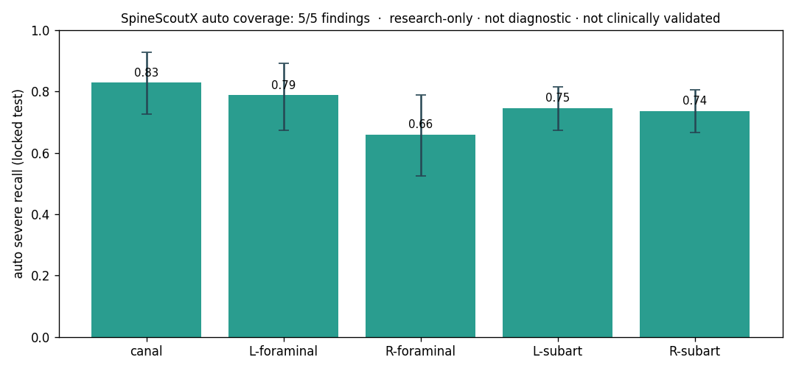
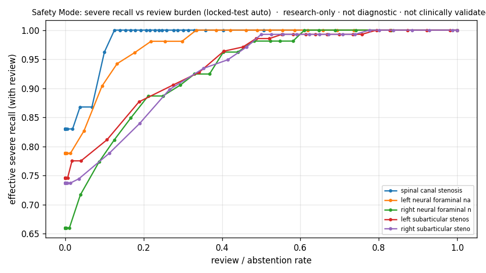

# SpineScoutX

**A research-only lumbar-MRI pipeline that reads a study with no ground-truth coordinates
and outputs a non-diagnostic, severe-safety-aware *research finding graph* — per level, per
condition, with calibrated confidence and review flags — validated on a patient-level
locked test.**

> ⚠️ **Research-only · not diagnostic · not clinically validated · not for medical
> decision-making · no treatment recommendations.** Severity values are *research findings /
> severity estimates*, never a diagnosis. Public non-commercial data (RSNA LumbarDISC;
> SPIDER CC BY 4.0); no data redistributed.

## What does it output?
A study-level **finding graph** — this is the actual model output (structured, no DICOM
pixels), one row per (condition, level, side): severity estimate, P(severe), calibrated
confidence, uncertainty flag, `review_required` + reason, view route, and provenance:



## Example case (real locked-test output, anonymized)


Confident findings are `high_confidence`; borderline ones are flagged `review_required`
with an explicit reason (low confidence, model disagreement, near-severe, axial-level
uncertainty). Provenance is `auto` — **no ground-truth coordinates at inference**. More
cases (incl. failures) in the **[gallery](docs/gallery.md)**.

## Current capability — 5/5 findings have real auto inference


| finding | view route | locked-test **auto** severe recall [95% CI] |
|---|---|---|
| spinal canal stenosis | sagittal-T2 | **0.830 [0.725, 0.929]** |
| left neural foraminal narrowing | sagittal-T1 | **0.788 [0.673, 0.892]** |
| right neural foraminal narrowing | sagittal-T1 | **0.660 [0.524, 0.788]** |
| left subarticular stenosis | axial-T2 | **0.746 [0.674, 0.815]** |
| right subarticular stenosis | axial-T2 | **0.737 [0.667, 0.807]** |

Every number is on a **never-tuned patient-level locked test**, auto = real inference, with
cluster-bootstrap CIs. *Core finding:* robust auto-training helps in proportion to the
oracle→auto gap (it recovers canal & subarticular where localization is hard; foraminal's
clean localizer needs none — grader chosen per condition).

## Safety Mode (severe-first)


Per condition: severe-recall vs false-alarm frontier + a `review_required` layer
(low confidence · high entropy · model disagreement · axial-level uncertainty). Reaching
90% severe recall has an explicit false-alarm / review cost — reported, never hidden.

## Where it fails (shown, not hidden)
Right-foraminal trails left (within CI overlap); the axial level scorer is imperfect (±1
slice-hit 0.43 — the grader tolerates it); severe counts are modest (wide CIs). See the
**[failure gallery](docs/gallery.md#6-failure--uncertainty-gallery-shown-not-hidden)** and
**[trust & limitations](docs/trust_and_limitations.md)**.

## Quickstart
```bash
pip install -e .
spinescoutx doctor --data                      # checks RSNA/SPIDER + deps
# data required (docs/data_setup.md). Regenerate the model-output showcase:
python scripts/make_model_output_showcase.py   # finding-graph cards + JSON/MD pack
python scripts/run_safety_mode_v4.py           # 5/5 severe-first dashboard
# reproduce the locked-test routes:
python scripts/build_splits_v1.py
python scripts/run_canal_locked_test.py && python scripts/run_foraminal_locked_test.py
python scripts/run_axial_level_scorer.py && python scripts/run_subarticular_locked_test.py
```

## Trust & limitations (read this)
**An academic research prototype, not an FDA/CE-cleared medical product.** No external,
prospective, or reader-study validation. Not diagnostic, not clinical. Details:
[`docs/trust_and_limitations.md`](docs/trust_and_limitations.md),
[`docs/safety.md`](docs/safety.md).

## Full docs
- 🖼 [Gallery](docs/gallery.md) · 📊 [Results + CIs](docs/results.md) ·
  🧪 [Technical report](docs/technical_report.md)
- 🪪 [Model card](docs/model_card.md) · [Dataset card](docs/dataset_card.md) ·
  🔒 [Safety policy](docs/safety.md) · 🔁 [Reproducibility](docs/reproducibility.md)
- 🧩 [Output schema](docs/run_logs/report_schema_v4.md) ·
  [Output audit](docs/run_logs/output_intelligence_audit.md)

## License
Code: MIT ([`LICENSE`](LICENSE)). **Datasets are NOT covered by MIT** and are not included
(RSNA non-commercial; SPIDER CC BY 4.0). No DICOMs, masks, checkpoints, caches, or runs are
committed.
