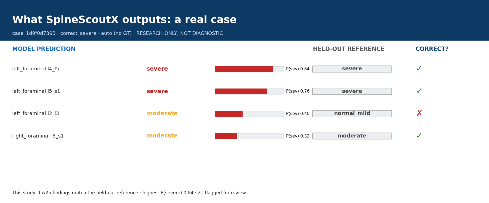
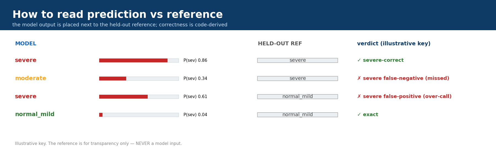
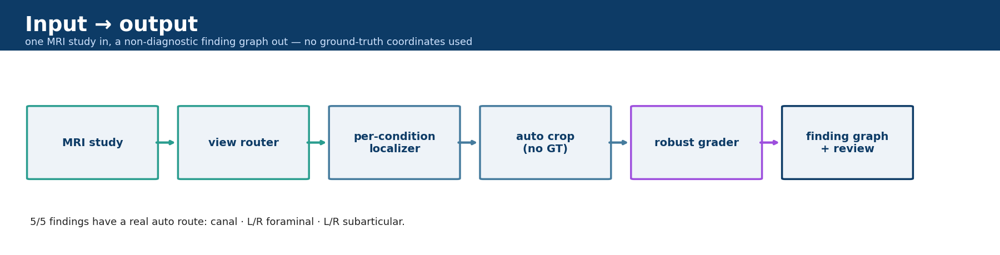
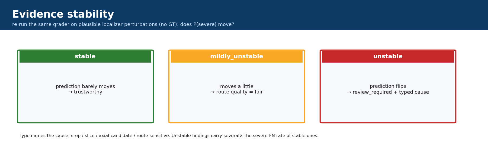
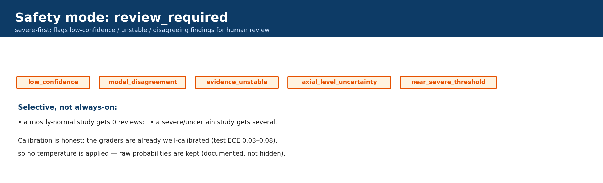
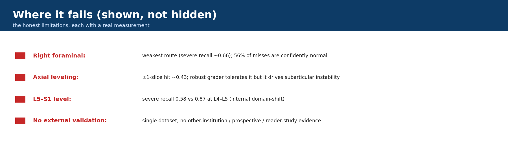

# SpineScoutX

**A research-only lumbar-MRI pipeline that reads a study with no ground-truth coordinates and
outputs a non-diagnostic, severe-safety-aware *research finding graph* — then shows that output
next to the held-out reference so you can see where it is right, uncertain, or wrong.**

> ⚠️ **Research-only · not diagnostic · not clinically validated · not for medical
> decision-making · no treatment recommendations.** Severity values are *research findings /
> severity estimates*, never a diagnosis. Public non-commercial data (RSNA LumbarDISC; SPIDER
> CC BY 4.0); no data redistributed. **5/5 findings have a real auto-inference route.**

## See what it actually does — one real locked-test case


Left = the **model prediction** (severity estimate + P(severe)); right = the **held-out
reference label** (shown for transparency only — *never* a model input); far right = the
**code-derived correctness** (✓/✗). Provenance is `auto` — **no ground-truth coordinates at
inference**. Full sectioned cards (evidence route, safety, failure note) are in the
**[case gallery](docs/gallery.md)**; here is how to read one:



## See real examples (correct, uncertain, and wrong)
| | a real case card |
|---|---|
| **Correct severe** (canal) | [`case_canal_correct_severe`](docs/assets/cases/case_canal_correct_severe.png) |
| **Hard — right-foraminal severe miss** | [`case_right_foraminal_hard`](docs/assets/cases/case_right_foraminal_hard.png) |
| **Unstable → flagged for review** | [`case_axial_unstable`](docs/assets/cases/case_axial_unstable.png) |
| **Review catches a severe FN** | [`case_review_required`](docs/assets/cases/case_review_required.png) |
| **Mostly normal — 0 reviews** | [`case_mostly_normal`](docs/assets/cases/case_mostly_normal.png) |

Each card is wide and readable, with an explicit **prediction-vs-held-out-reference** column.

## Coverage & performance (locked-test **auto** = real inference)
| finding | view route | severe recall [95% CI] |
|---|---|---|
| spinal canal stenosis | sagittal-T2 | **0.830** [0.725, 0.929] |
| left neural foraminal narrowing | sagittal-T1 | **0.788** [0.673, 0.892] |
| right neural foraminal narrowing | sagittal-T1 | **0.660** [0.524, 0.788] |
| left subarticular stenosis | axial-T2 | **0.746** [0.674, 0.815] |
| right subarticular stenosis | axial-T2 | **0.737** [0.667, 0.807] |

Every number is on a **never-tuned patient-level locked test**, auto = real inference, with
cluster-bootstrap CIs. Full results: [`docs/results.md`](docs/results.md).

## How it works


*Core finding:* robust auto-training helps in proportion to the oracle→auto localization gap
(it recovers canal & subarticular; foraminal's clean localizer needs none — grader chosen per
condition).

## Evidence-aware intelligence (v1.1–v1.2)


Each finding carries an **evidence-stability** signal (re-grade under plausible localizer
perturbation, no GT) and an **instability *type*** (crop / slice / axial-candidate / route
sensitive) that names the *cause*. Honest result: instability predicts errors (pooled AUROC
0.80) but is largely redundant with confidence — it **adds** severe-FN triage value on the
weakest right-side routes, and every unstable type carries several× the severe-FN rate of
stable findings. See [`evidence_stability_v1.md`](docs/run_logs/evidence_stability_v1.md),
[`evidence_intelligence_v2.md`](docs/run_logs/evidence_intelligence_v2.md).

## Safety mode (severe-first, selective review)


Reaching 90% severe recall has an explicit false-alarm / review cost — reported, never hidden.
Calibration is a documented negative (graders already well-calibrated → raw probabilities kept).
See [`safety_mode_v5.md`](docs/run_logs/safety_mode_v5.md).

## Where it fails (shown, not hidden)


Right-foraminal is the weakest route (precisely characterized: 56% of its severe misses are
*confidently normal* — a signal/sample limit). Severe recall is weaker at L5-S1 (0.579) than
L4-L5 (0.868) ([domain-shift audit](docs/run_logs/external_validation_audit.md)); the axial
level scorer is imperfect (±1 slice-hit 0.43); **no external/prospective validation.** Details:
**[trust & limitations](docs/trust_and_limitations.md)**.

## Quickstart
```bash
pip install -e .
spinescoutx doctor --data                          # checks RSNA/SPIDER + deps
# data required (docs/data_setup.md). Regenerate the visible outputs:
python scripts/make_real_case_viewer_pack.py       # wide prediction-vs-reference case cards
python scripts/make_readme_assets_v12.py           # README explainer assets
python scripts/run_evidence_intel_v2.py            # instability typing
python scripts/run_safety_mode_v5.py               # evidence-aware severe-first dashboard
```

## Trust & limitations (read this)
**An academic research prototype, not an FDA/CE-cleared medical product.** No external,
prospective, or reader-study validation. Not diagnostic, not clinical. Details:
[`docs/trust_and_limitations.md`](docs/trust_and_limitations.md), [`docs/safety.md`](docs/safety.md).

## Full docs
- 🖼 [Gallery](docs/gallery.md) · 📊 [Results + CIs](docs/results.md) ·
  🧪 [Technical report](docs/technical_report.md)
- 🪪 [Model card](docs/model_card.md) · [Dataset card](docs/dataset_card.md) ·
  🔒 [Safety policy](docs/safety.md) · 🔁 [Reproducibility](docs/reproducibility.md)
- 🧩 [Finding-graph schema v5](docs/run_logs/report_schema_v5.md) ·
  [Case viewer](docs/run_logs/real_case_viewer.md) ·
  [Output audit](docs/run_logs/output_intelligence_audit.md)

## License
Code: MIT ([`LICENSE`](LICENSE)). **Datasets are NOT covered by MIT** and are not included
(RSNA non-commercial; SPIDER CC BY 4.0). No DICOMs, masks, checkpoints, caches, or runs are
committed.
