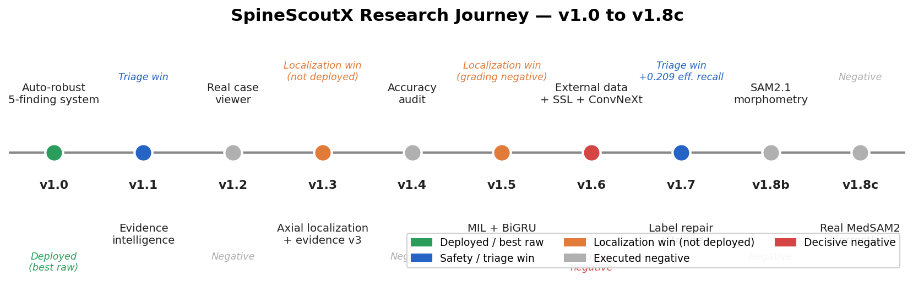
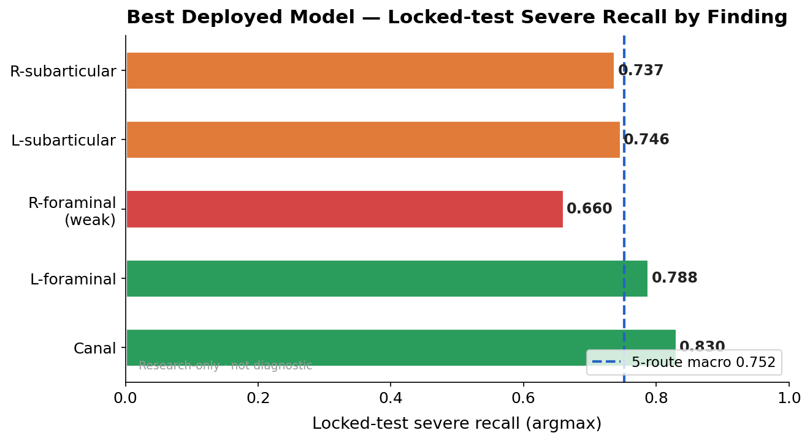
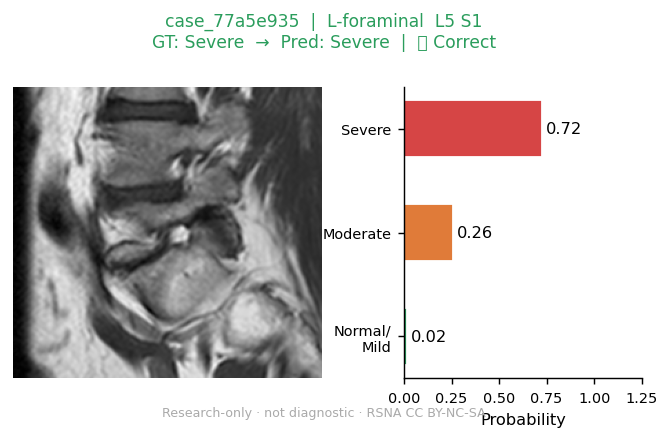
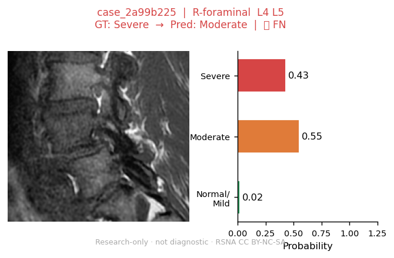
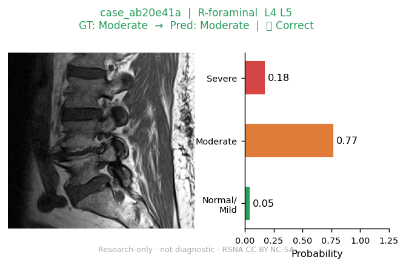
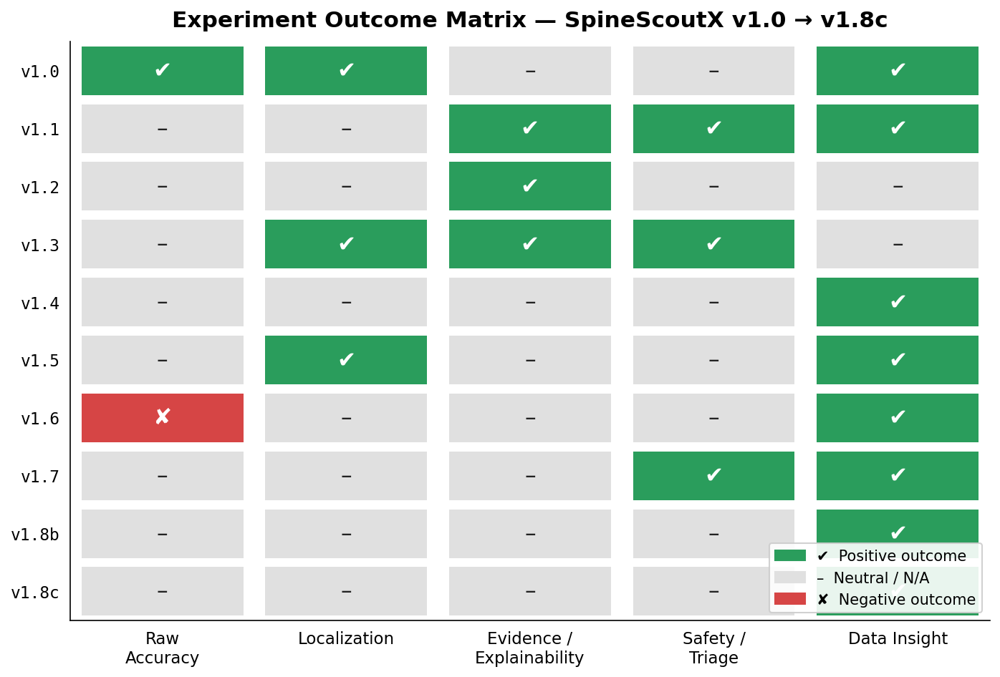
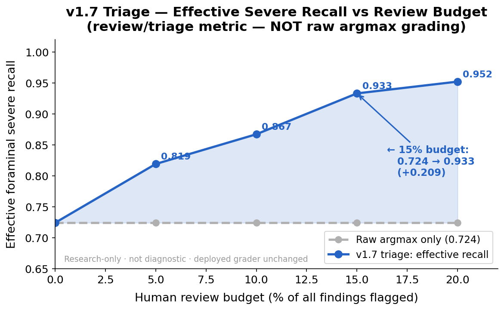
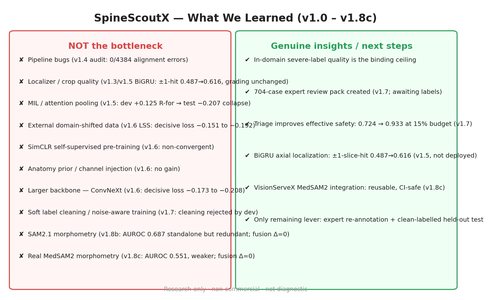

# SpineScoutX

> **Research-only lumbar MRI grading system for degenerative findings — not diagnostic.**
> Not clinically validated. Not for medical decision-making. Academic prototype only.

A complete, anatomy-grounded pipeline that takes a raw lumbar MRI study (no ground-truth
coordinates at inference) and outputs a structured research finding graph with severity
estimates, evidence signals, and safety/triage routing for all five degenerative findings.

[](docs/trust_and_limitations.md)
[](docs/model_card.md)
[](LICENSE)

---

## Current best result (locked-test, argmax)

| Finding | Severe recall | CI 95% |
|---|---|---|
| Spinal canal stenosis | **0.830** | [0.725, 0.929] |
| Left neural foraminal narrowing | **0.788** | [0.673, 0.892] |
| Right neural foraminal narrowing | **0.660** | [0.524, 0.788] |
| Left subarticular stenosis | **0.746** | [0.674, 0.815] |
| Right subarticular stenosis | **0.737** | [0.667, 0.807] |
| **5-route macro** | **0.752** | — |

Every number is on a **never-tuned patient-level locked test** (296 studies, 2,950 findings).
Auto inference only — no ground-truth coordinates at inference time. 95% CIs from cluster bootstrap.

### Safety / triage mode (v1.7)

The v1.7 severe-FN triage router ranks findings by misclassification risk. At a **15% review
budget**, effective foraminal severe recall improves from **0.724 → 0.933** (22/29 severe FN
captured). This is a *review-triage* metric — it does **not** change argmax predictions.

---

## Research journey



---

## What the system predicts

| Finding | View |
|---|---|
| Spinal canal stenosis | Sagittal T2 |
| Left neural foraminal narrowing | Sagittal T1 |
| Right neural foraminal narrowing | Sagittal T1 |
| Left subarticular stenosis | Axial T2 |
| Right subarticular stenosis | Axial T2 |

Severity scale: **Normal/Mild (0) · Moderate (1) · Severe (2)**

---

## Severe recall by finding (deployed model)



---

## Real example panels

Gate-verified anonymized panels (RSNA CC BY-NC-SA 4.0, private repo, no patient metadata):

| Correct severe | Right-foraminal FN | Review-required |
|---|---|---|
|  |  |  |

Full gallery (12 panels): [docs/assets/v1_9/real_cases/index.md](docs/assets/v1_9/real_cases/index.md)

---

## Experiment outcome matrix



Ten versions, nine strategies. One set the raw accuracy ceiling (v1.0). One produced a real
triage safety upgrade (v1.7). Everything else was an executed negative. The binding constraint
is **in-domain severe-label quality**, not architecture, training strategy, external data, SSL,
or segmentation-morphometry.

Full history: [docs/run_logs/v1_9_experiment_history_summary.md](docs/run_logs/v1_9_experiment_history_summary.md)

### What was tried and did NOT improve raw accuracy

| Strategy | Verdict |
|---|---|
| Pipeline bug hunt (v1.4) | No bug — ceiling is label-limited |
| Candidate-bag MIL grader (v1.5) | Dev +0.125 → test −0.207 (overfit) |
| BiGRU axial stack for grading (v1.5) | Best localization win; grading unchanged |
| External LSS-MRI data (v1.6) | Decisive loss (domain shift) |
| SimCLR self-supervised pre-training (v1.6) | Non-convergent |
| ConvNeXt-Small backbone (v1.6) | Decisive loss (capacity not the bottleneck) |
| Hard-case label cleaning + noise-aware (v1.7) | Dev rejected cleaned labels |
| SAM2.1 segmentation morphometry (v1.8b) | Redundant with image grader (Δ=0) |
| Real MedSAM2 morphometry (v1.8c) | Weaker than SAM2.1; redundant (Δ=0) |

---

## Triage / safety mode



> **Note:** review-routing metric only — deployed grader unchanged; triage recommends cases
> for radiologist review, does not override argmax predictions.

---

## What we learned



---

## Best model download

Best raw model weights and triage config are in the
[GitHub Release `v1.9.0-research-story-best-model`](https://github.com/arashsajjadi/SpineScoutX/releases/tag/v1.9.0-research-story-best-model):

| Asset | Size |
|---|---|
| `spinescoutx-best-raw-v1.9.tar.gz` | ~495 MiB |
| `spinescoutx-triage-config-v1.9.tar.gz` | < 1 MiB |

SHA-256 checksums: [`docs/assets/v1_9/checksums.txt`](docs/assets/v1_9/checksums.txt)
Weights are **not** in Git history (> 50 MiB → GitHub Release asset only).

---

## Reproduce results

```bash
pip install -e .
spinescoutx doctor --data                          # verify RSNA/SPIDER + deps
python scripts/reproduce_best_metrics_v1_9.py      # reproduce locked-test numbers
python scripts/generate_readme_assets_v1_9.py      # regenerate gallery panels
python scripts/create_v1_9_charts.py               # regenerate charts
python scripts/verify_release_assets_v1_9.py       # verify model package checksums
```

Full reproducibility: [docs/reproducibility.md](docs/reproducibility.md)

---

## Limitations

- **Not diagnostic.** Not clinically validated. Not FDA/CE-cleared.
- Right-foraminal is the weakest route (56% of severe misses confidently-normal; n≈53 severe).
- Severe recall is weaker at L5-S1 (0.579) than L4-L5 (0.868).
- No external or prospective validation.
- Label quality is the binding ceiling — raw accuracy will not improve without expert re-annotation.
- Triage captures 76% of FN at 15% budget but misses 24%.

Details: [docs/trust_and_limitations.md](docs/trust_and_limitations.md)

---

## Data and licence

- Code: **MIT** ([LICENSE](LICENSE))
- **RSNA 2024 Lumbar Spine Degenerative Classification**: CC BY-NC-SA 4.0, non-commercial
  research only. Not redistributed. ([data setup](docs/data_setup.md))
- **SPIDER**: CC BY 4.0. ([dataset card](docs/dataset_card.md))
- No DICOMs, NIfTIs, masks, checkpoints, caches, runs, or tokens committed.

---

## Documentation

| Doc | Contents |
|---|---|
| [Technical report](docs/technical_report.md) | Full experiment details and architecture |
| [Results](docs/results.md) | All metrics with CIs |
| [Model card](docs/model_card.md) | Intended use, limitations, caveats |
| [Model zoo](docs/model_zoo.md) | Weight registry and download instructions |
| [Trust & limitations](docs/trust_and_limitations.md) | Failure modes, honest caveats |
| [Reproducibility](docs/reproducibility.md) | How to reproduce every number |
| [Data & privacy](docs/data_and_privacy.md) | Data handling and privacy policy |
| [Release notes v1.9](docs/release_notes/v1_9.md) | This release |
| [Experiment history](docs/run_logs/v1_9_experiment_history_summary.md) | Full v1.0–v1.8c history |
