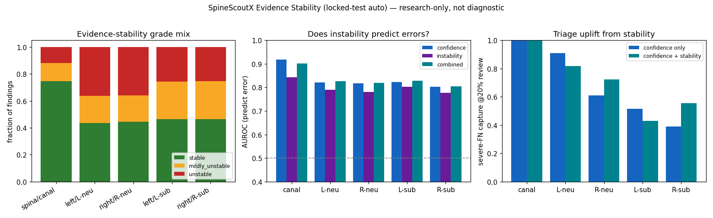

# SpineScoutX

**A research-only lumbar-MRI pipeline that reads a study with no ground-truth coordinates
and outputs a non-diagnostic, severe-safety-aware *research finding graph* — per level, per
condition, with calibrated confidence and review flags — validated on a patient-level
locked test.**

> ⚠️ **Research-only · not diagnostic · not clinically validated · not for medical
> decision-making · no treatment recommendations.** Severity values are *research findings /
> severity estimates*, never a diagnosis. Public non-commercial data (RSNA LumbarDISC;
> SPIDER CC BY 4.0); no data redistributed.

## What does it output?
A study-level **finding graph** — this is the actual model output (structured, no DICOM
pixels), one row per (condition, level, side): severity estimate, P(severe), calibrated
confidence, uncertainty flag, `review_required` + reason, view route, and provenance:


## Example case (real locked-test output, anonymized)


Confident findings are `high_confidence`; borderline ones are flagged `review_required`
with an explicit reason (low confidence, model disagreement, near-severe, axial-level
uncertainty). Provenance is `auto` — **no ground-truth coordinates at inference**. More
cases (incl. failures) in the **[gallery](docs/gallery.md)**.

## Current capability — 5/5 findings have real auto inference


| finding | view route | locked-test **auto** severe recall [95% CI] |
|---|---|---|
| spinal canal stenosis | sagittal-T2 | **0.830 [0.725, 0.929]** |
| left neural foraminal narrowing | sagittal-T1 | **0.788 [0.673, 0.892]** |
| right neural foraminal narrowing | sagittal-T1 | **0.660 [0.524, 0.788]** |
| left subarticular stenosis | axial-T2 | **0.746 [0.674, 0.815]** |
| right subarticular stenosis | axial-T2 | **0.737 [0.667, 0.807]** |

Every number is on a **never-tuned patient-level locked test**, auto = real inference, with
cluster-bootstrap CIs. *Core finding:* robust auto-training helps in proportion to the
oracle→auto gap (it recovers canal & subarticular where localization is hard; foraminal's
clean localizer needs none — grader chosen per condition).

## Evidence-aware intelligence (v1.1)


Beyond a single prediction, each finding now carries an **evidence-stability** signal: the
same grader is re-run on K plausible localizer perturbations (in-plane jitter + slice shift,
from auto coordinates only — **no ground truth**) and we measure how much P(severe) moves.
Honest results (locked-test auto, baseline reproduces the deployed predictions exactly):

- **Instability predicts errors** (pooled AUROC 0.80) and severe false-negatives (0.71) —
  above chance — but is **largely redundant with confidence** (we do not overclaim).
- It **adds severe-FN triage value on exactly the 2 weakest right-side routes**
  (right-foraminal capture 0.72→0.89 @30% review; right-subarticular 0.42→0.56 @20%).
- **Robust-trained graders are more stable** (canal 75% stable) than the oracle-trained
  foraminal grader (44%) — stability validates the robust-training thesis.

It feeds the finding graph's `evidence_stability` + `route_quality` fields and Safety Mode
v5's review reasons. See [`evidence_stability_v1.md`](docs/run_logs/evidence_stability_v1.md).

## Safety Mode (severe-first, evidence-aware v5)


Per condition: severe-recall vs false-alarm frontier + a `review_required` layer
(low confidence · model disagreement · **evidence-unstable** · axial-level uncertainty).
Reaching 90% severe recall has an explicit false-alarm / review cost — reported, never
hidden. **Calibration is a documented negative:** the graders are already well-calibrated
(test ECE 0.03–0.08), so dev-fit temperature does not transfer — the deployed path keeps raw
probabilities. See [`safety_mode_v5.md`](docs/run_logs/safety_mode_v5.md).

## Where it fails (shown, not hidden)
Right-foraminal trails left (within CI overlap) — **precisely characterized:** 56% of its
severe misses are *confidently normal* (a signal/sample limit, not threshold-fixable; at
at L4-L5 right). Severe recall is robust across resolution/matrix size but **weaker at L5-S1
(0.579) vs L4-L5 (0.868)** ([domain-shift audit](docs/run_logs/external_validation_audit.md));
the axial level scorer is imperfect (±1 slice-hit 0.43 — the grader tolerates it); severe
counts are modest (wide CIs); **no external/prospective validation.** See the
**[failure gallery](docs/gallery.md#7-failure--uncertainty-gallery-shown-not-hidden)** and
**[trust & limitations](docs/trust_and_limitations.md)**.

## Quickstart
```bash
pip install -e .
spinescoutx doctor --data                      # checks RSNA/SPIDER + deps
# data required (docs/data_setup.md). Regenerate the model-output showcase:
python scripts/make_model_output_showcase.py   # finding-graph cards + JSON/MD pack (v5)
python scripts/run_evidence_stability.py       # evidence-stability scoring + eval
python scripts/run_safety_mode_v5.py           # evidence-aware severe-first dashboard
python scripts/run_domain_shift_audit.py       # internal domain-shift stress test
# reproduce the locked-test routes:
python scripts/build_splits_v1.py
python scripts/run_canal_locked_test.py && python scripts/run_foraminal_locked_test.py
python scripts/run_axial_level_scorer.py && python scripts/run_subarticular_locked_test.py
```

## Trust & limitations (read this)
**An academic research prototype, not an FDA/CE-cleared medical product.** No external,
prospective, or reader-study validation. Not diagnostic, not clinical. Details:
[`docs/trust_and_limitations.md`](docs/trust_and_limitations.md),
[`docs/safety.md`](docs/safety.md).

## Full docs
- 🖼 [Gallery](docs/gallery.md) · 📊 [Results + CIs](docs/results.md) ·
  🧪 [Technical report](docs/technical_report.md)
- 🪪 [Model card](docs/model_card.md) · [Dataset card](docs/dataset_card.md) ·
  🔒 [Safety policy](docs/safety.md) · 🔁 [Reproducibility](docs/reproducibility.md)
- 🧩 [Output schema v5](docs/run_logs/report_schema_v5.md) ·
  [Output audit](docs/run_logs/output_intelligence_audit.md) ·
  🧭 [Evidence stability](docs/run_logs/evidence_stability_v1.md) ·
  [Domain-shift audit](docs/run_logs/external_validation_audit.md)

## License
Code: MIT ([`LICENSE`](LICENSE)). **Datasets are NOT covered by MIT** and are not included
(RSNA non-commercial; SPIDER CC BY 4.0). No DICOMs, masks, checkpoints, caches, or runs are
committed.
