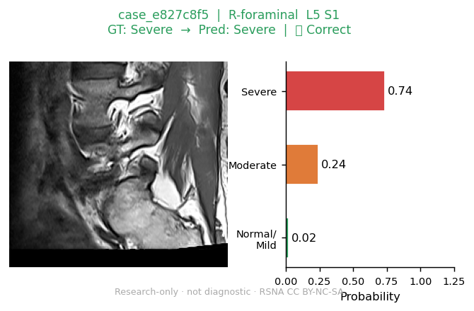
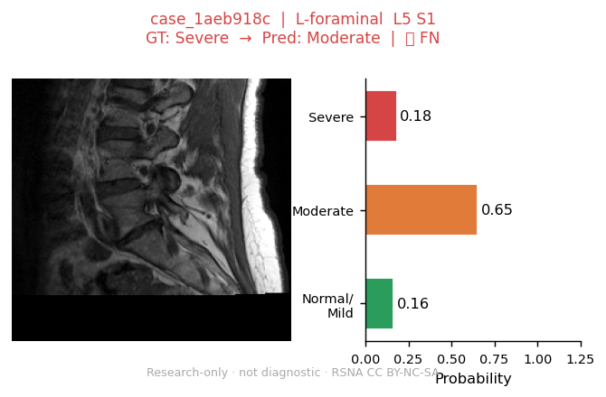
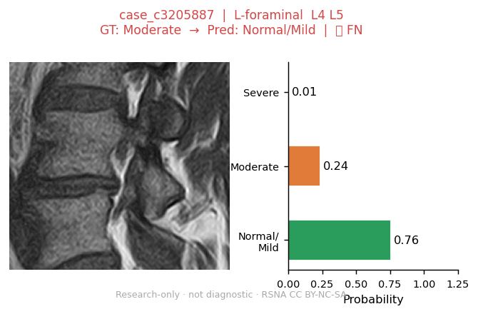
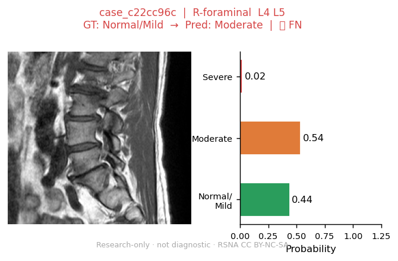
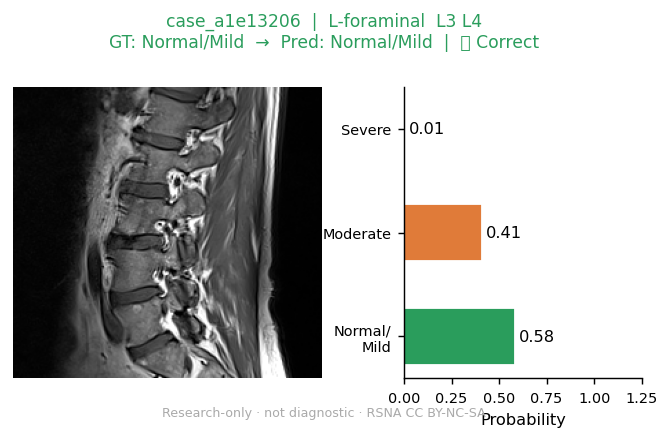
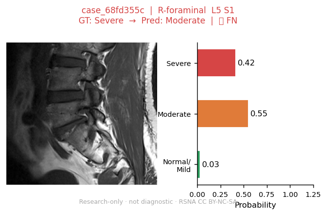
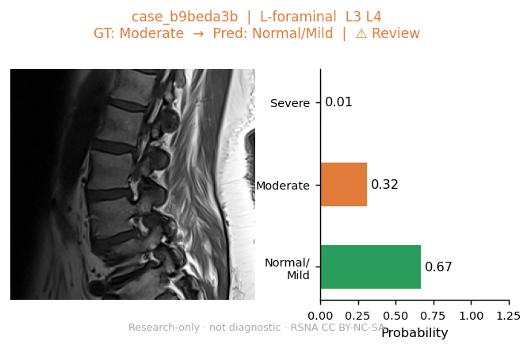
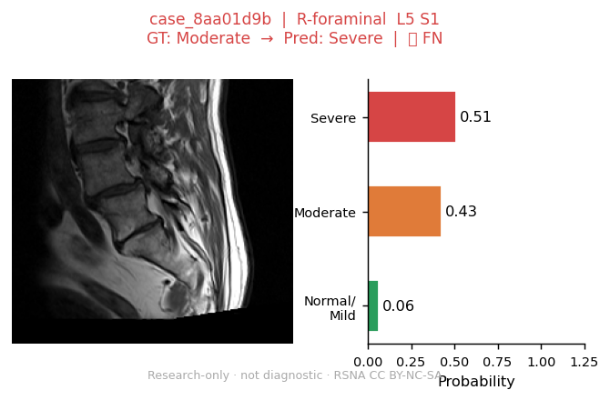
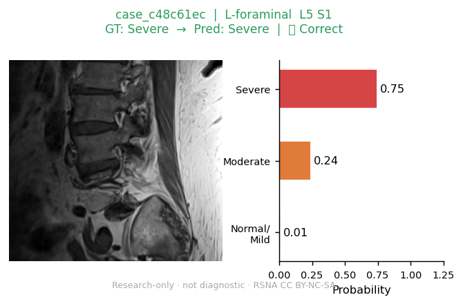

# v1.9 real-case gallery

> Research-only · non-commercial · not diagnostic.
> RSNA 2024 dataset: CC BY-NC-SA 4.0. Case IDs = anonymized SHA-1 hashes.
> Panels: central slice crop + probability bar + GT/prediction. No patient metadata. No raw DICOMs.

| Panel | Finding | Level | GT | Prediction |
|---|---|---|---|---|
|  | left neural foraminal narrowing | L5 S1 | Severe | Severe |
|  | right neural foraminal narrowing | L5 S1 | Severe | Severe |
|  | right neural foraminal narrowing | L4 L5 | Severe | Moderate |
|  | left neural foraminal narrowing | L5 S1 | Severe | Moderate |
|  | right neural foraminal narrowing | L4 L5 | Moderate | Moderate |
|  | left neural foraminal narrowing | L4 L5 | Moderate | Normal/Mild |
|  | right neural foraminal narrowing | L4 L5 | Normal/Mild | Moderate |
|  | left neural foraminal narrowing | L3 L4 | Normal/Mild | Normal/Mild |
|  | right neural foraminal narrowing | L5 S1 | Severe | Moderate |
|  | left neural foraminal narrowing | L3 L4 | Moderate | Normal/Mild |
|  | right neural foraminal narrowing | L5 S1 | Moderate | Severe |
|  | left neural foraminal narrowing | L5 S1 | Severe | Severe |
