# SpineScoutX gallery — model outputs, routing, and failures

> Research-only · not diagnostic · not clinically validated · not for medical
> decision-making. Every card renders a **structured model output** (a finding graph) or a
> metric plot — **no DICOM pixels, no patient identifiers** (cases are hashed `case_*`).
> Regenerate: `python scripts/make_model_output_showcase.py` and
> `python scripts/make_showcase_assets.py`.

## 1. What the model receives → what it does

An MRI study → a **view router + per-condition localizers** → auto crops placed **without
ground-truth coordinates** → robust per-condition graders → Safety Mode review layer →
a non-diagnostic finding graph.

## 2. How routing works
| finding | view route | localization |
|---|---|---|
| spinal canal stenosis | sagittal-T2 | disc localizer (median 2.5 px) |
| L/R neural foraminal narrowing | sagittal-T1 | side-aware best-slice localizer (median 2.2 px) |
| L/R subarticular stenosis | axial-T2 | coordinate-supervised axial level scorer + fixed offset |

## 3. The output: a study-level finding graph
This is what comes out — per-level/per-condition severity estimate, P(severe), calibrated
confidence, uncertainty flag, review reasons, view route, provenance:

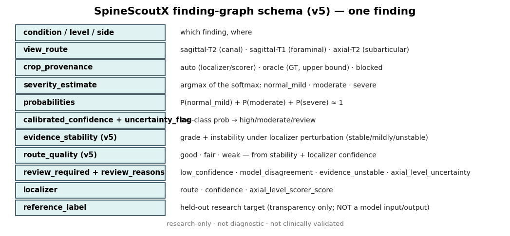

## 4. Example cases (real locked-test model outputs)
| | card |
|---|---|
| canal — severe |  |
| left foraminal | 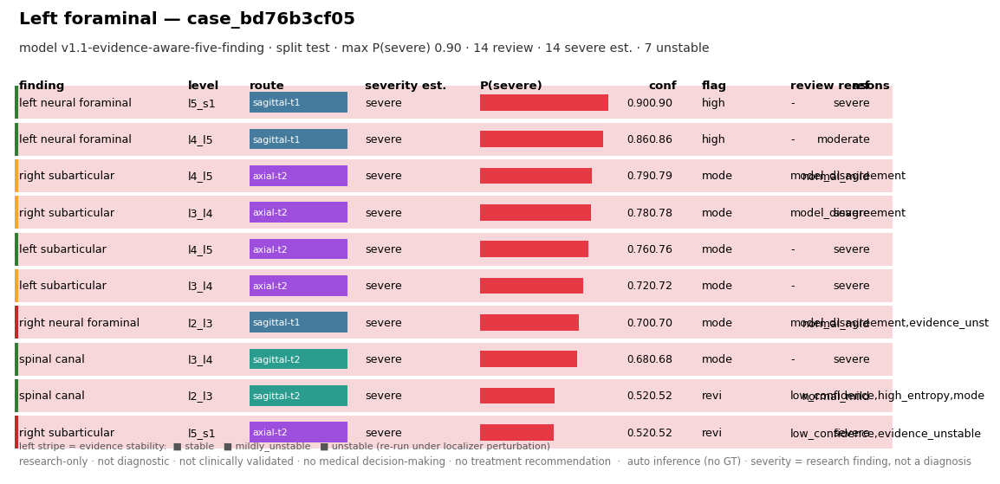 |
| left subarticular | 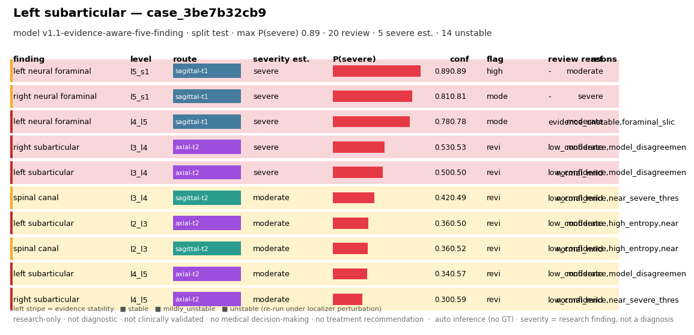 |
| right subarticular | 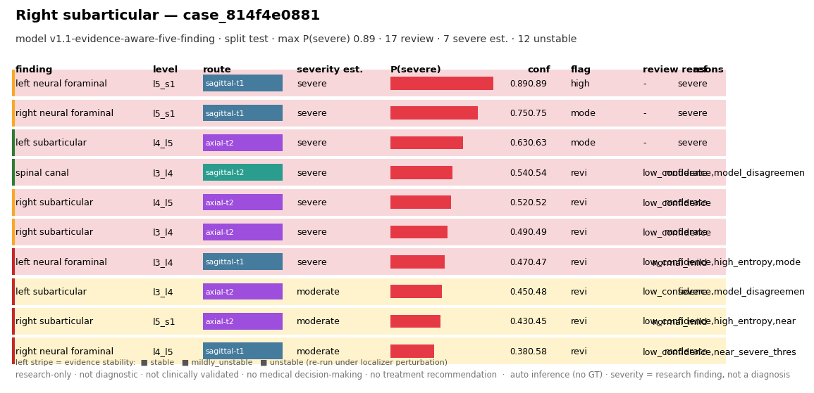 |

*Interpretation:* confident findings are flagged `high_confidence`; borderline ones get
`review_required` with an explicit reason. Provenance is `auto` (no GT at inference).
`ref` is the held-out research target (transparency only).

## 5. Evidence-aware intelligence (v1.1)
Each finding is re-graded under K plausible localizer perturbations (no GT) to score how
**stable** the prediction is. Cards carry a left **stability stripe** (green=stable,
amber=mildly, red=unstable), a `route_quality` flag, and stability-driven review reasons.

| | card |
|---|---|
| stable, high-confidence (`route_quality` good) | 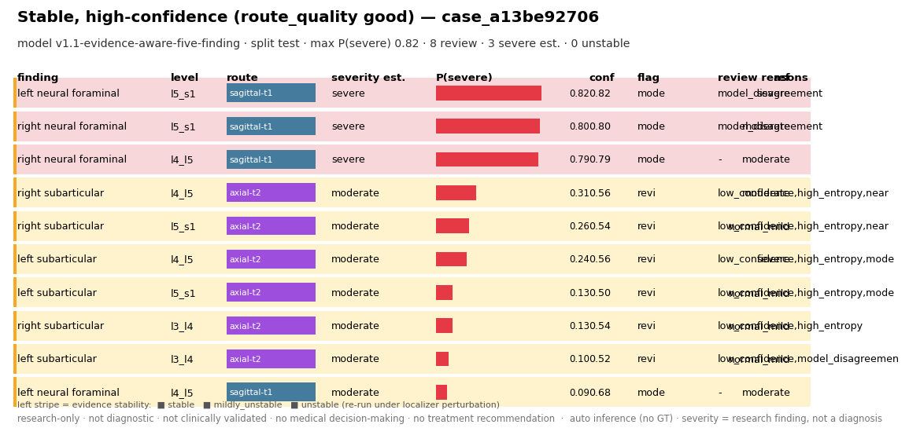 |
| **unstable** finding flagged by evidence stability | 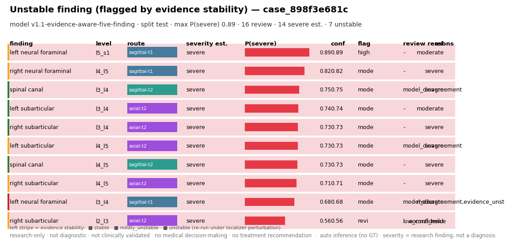 |

Honest result: instability predicts errors (AUROC 0.80) but is largely redundant with
confidence; it **adds** severe-FN triage value on the 2 weakest right-side routes.
Robust-trained graders are more stable than the oracle-trained foraminal grader.

## 6. Safety Mode (evidence-aware v5)

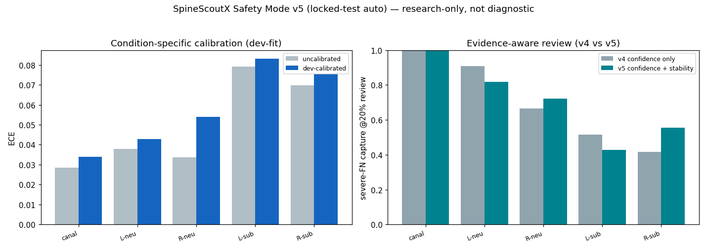

Per condition, effective severe recall vs the `review_required` burden — reaching high
severe recall has an explicit cost, shown plainly. v5 adds an `evidence_unstable` review
reason; calibration is a documented negative (already well-calibrated → raw probs kept).

## 7. Failure & uncertainty gallery (shown, not hidden)
| case | what it shows | limitation |
|---|---|---|
| 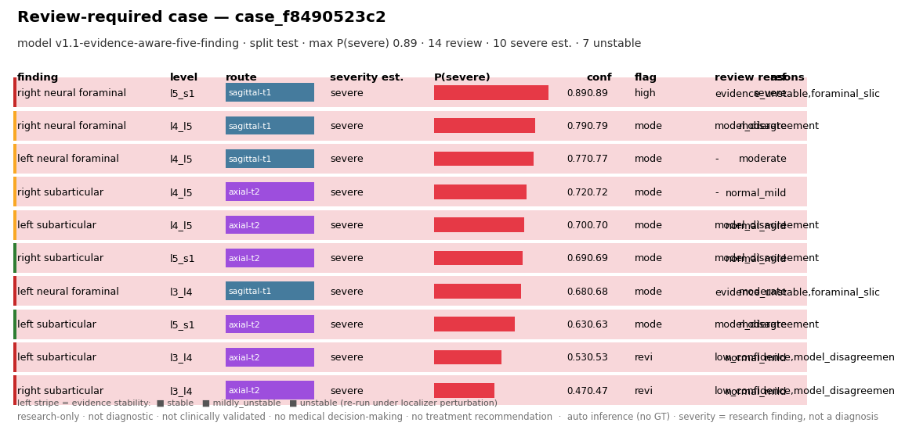 | many borderline findings → `review_required` | the review layer is deliberately conservative (over-flags for safety) |
| 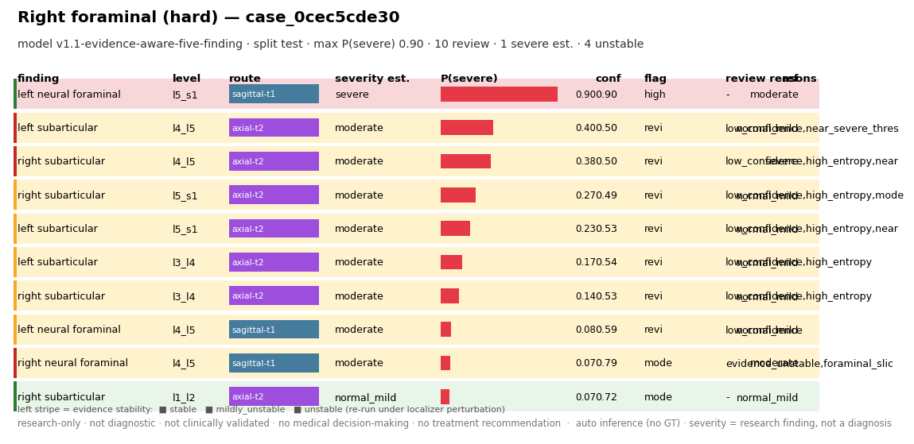 | right-foraminal hard case | right-foraminal trails left (within CI overlap) |
| 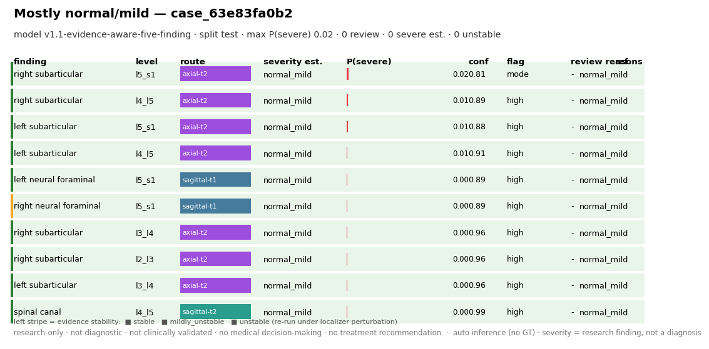 | mostly normal/mild, **0 reviews** | shows the flag is selective, not always-on |
| 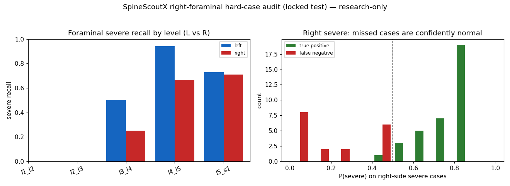 | right-foraminal failure analysis: 56% of misses are confidently-normal | a signal/sample limit, not threshold-fixable; worst at L4-L5 right |
| 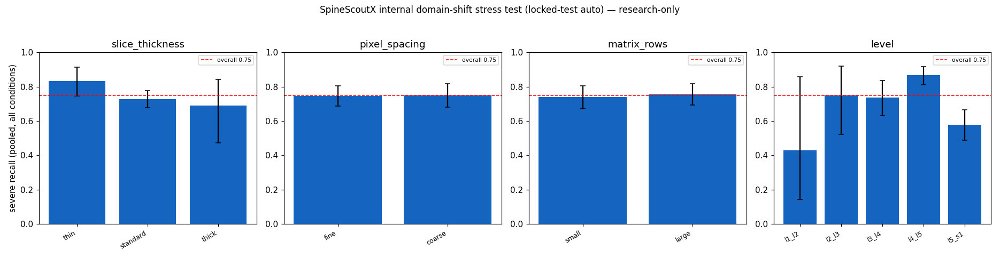 | internal domain-shift stress test | weaker at L5-S1 (0.579) vs L4-L5 (0.868); no external validation |

Coverage and oracle-vs-auto context:

## 8. What NOT to use this for
**Not** a diagnosis. **Not** clinical decision-making. **No** treatment recommendations.
A research prototype on public non-commercial data; no external/prospective/reader-study
validation. See [`trust_and_limitations.md`](trust_and_limitations.md).

## Where the numbers come from
Full pack (JSON/MD, gitignored): `outputs/real/showcase_reports/`. Schema:
[`run_logs/report_schema_v5.md`](run_logs/report_schema_v5.md). Audit:
[`run_logs/output_intelligence_audit.md`](run_logs/output_intelligence_audit.md). Results +
CIs: [`results.md`](results.md).
